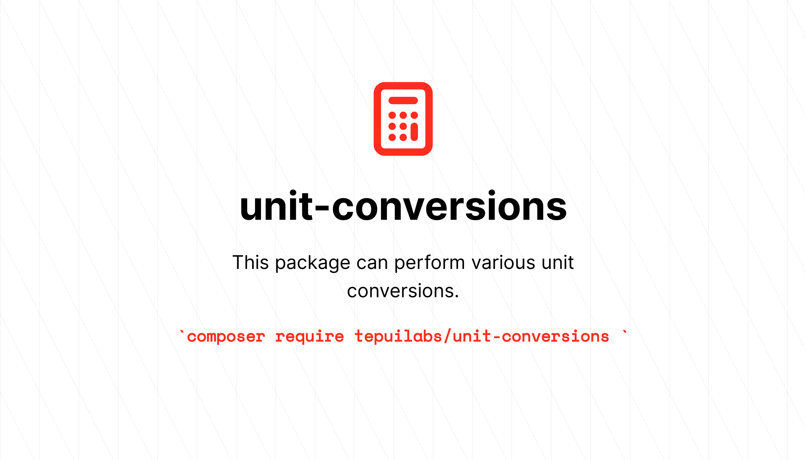

<p align="center">
	
</p>

# Perform unit conversions

[](https://packagist.org/packages/tepuilabs/unit-conversions)
[](https://github.com/tepuilabs/unit-conversions/actions?query=workflow%3Arun-tests+branch%3Amaster)
[](https://packagist.org/packages/tepuilabs/unit-conversions)


This package can perform various unit conversions.

## Installation

You can install the package via composer:

```bash
composer require tepuilabs/unit-conversions
```

## Usage

``` php
$lbs = \Tepuilabs\UnitConversions\Weight::fromKilograms(100)->toLbs();
```

## Testing

``` bash
composer test
```

## Changelog

Please see [CHANGELOG](CHANGELOG.md) for more information on what has changed recently.

## Contributing

Please see [CONTRIBUTING](.github/CONTRIBUTING.md) for details.

## Security Vulnerabilities

Please open a new issue ;)

## Credits

- [angel cruz](https://github.com/abr4xas)
- [All Contributors](../../contributors)

## License

The MIT License (MIT). Please see [License File](LICENSE.md) for more information.
